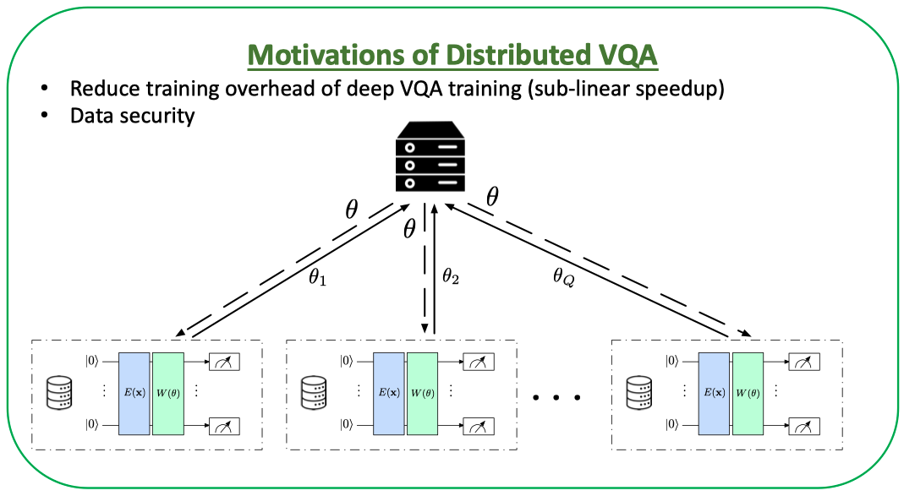

## Project: Federated VQA Training
Course PHSX600-801 project - Topic: "Distributed Quantum Machine Learning"

## Introduction
This project is to implement a distributed quantum machine learning algorithm using PennyLane and PyTorch. The algorithm is based on the paper [Accelerating variational quantum algorithms with multiple quantum processors](https://arxiv.org/abs/2106.12819) by Yuxuan Du, Yang Qian, and Dacheng Tao. We modify the algorithm to use PennyLane and change the quantum circuit architecture based on phase encoding and data re-uploading techniques.

## Motivation and Background

- In current quantum machine learning algorithms, simulating deep quantum circuits on classical computers is computationally expensive.
- In order to speed up the VQA training process, we leverage the federated learning framework to distribute the quantum circuits to multiple quantum processors. The federated VQA training shares the same motivation as federated learning in classical machine learning, which is to reduce the computational cost (scalability) and improve data privacy. 

## Instructions to run the code
The classical vs VQC algorithm is implemented in the file `VQA_mnist.py`. 
The distributed VQC algorithm is implemented in the file `DVQA_mnist`.
